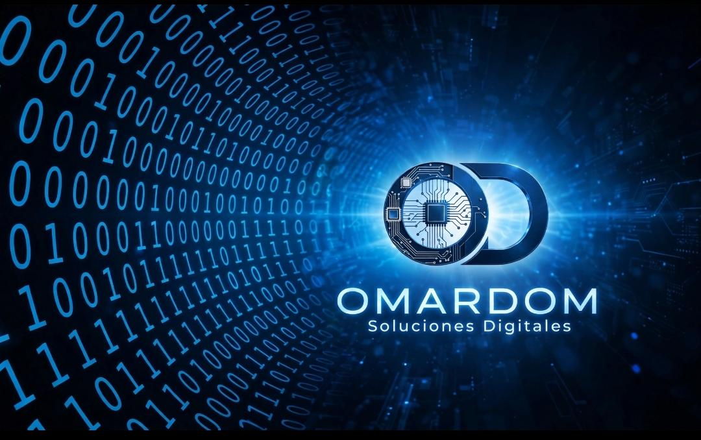

<p align="center">
  
</p>

<h1 align="center">🛡️ SGH-V1 / SGL-O2</h1>
<p align="center">
  <b>Ecosistema Enterprise de Compliance Regulatorio, Gestión Multi-Entidad, Medicina Laboral (PsyMed), Materiales Controlados y Facturación Fiscal ARCA</b><br>
  <i>Plataforma Tecnológica Adaptable de Misión Crítica para Seguridad Corporativa, Minería, Oil & Gas, Logística de Caudales e Industrias Altamente Reguladas</i>
</p>

<p align="center">
  
  
  
  
  
  
  
  
  
  
</p>

---

## 📊 Métricas y Capacidad de la Plataforma en Producción

| Indicador Estratégico | Métrica Productiva | Alcance Operativo |
| :--- | :---: | :--- |
| **Catálogo Maestro de Servicios** | **Servicios Activos** | Habilitaciones Legales, Medicina Laboral (PsyMed), Gobierno Corporativo, Mentoría Técnica y Trámites Especiales. |
| **Matrices Dinámicas de Trámites** | **Plantillas Configuradas** | Checklists automatizados y no retroactivos por combinación de Entidad, Rol y Tipo de Gestión. |
| **Central de Comando Operativo** | **Dashboard 4x4 en Tiempo Real** | Seguimiento unificado para **Mesa de Entradas (Sala de Espera)**, **Empresas & Plantas/Sedes**, **Personal & Legajos** y **Gestión Comercial & Fiscal**. |
| **Dimensiones de Gestión** | **4 Entidades Simultáneas** | Control normativo unificado sobre **Personal**, **Empresas**, **Objetivos/Plantas** y **Flotas de Vehículos**. |
| **Ámbitos Jurisdiccionales Auditados** | **9 Jurisdicciones Activas** | CABA (DGSP), PBA (Ley 12.297), ANMAC / RENAR, PNA (Prefectura), PSA (Aeroportuaria), AUSA (Vial), Nacional (RNR) y Medicina Laboral SRT. |
| **Módulo Hipersensible ANMAC** | **Ley Nacional N° 20.429** | Polvorines quinquenales, importación de explosivos, insumos de fractura Oil & Gas (tubing cutters, cargas huecas) y habilitación UPSV. |
| **Integración Fiscal Oficial** | **ARCA (ex AFIP) en Vivo** | Consulta de padrón CUIT en tiempo real, emisión de Facturas A/B y Notas de Crédito con CAE y código QR oficial. |

---

## 🌟 Visión, Propósito y Adaptabilidad Universal

El **SGH-V1 (Sistema de Gestión de Habilitaciones - Versión 1 / SGL-O2)** es una plataforma de software de nivel industrial diseñada para gobernar la alta complejidad operativa, legal, regulatoria y económica de cualquier actividad donde el cumplimiento normativo es **condición indispensable para operar**.

### 🎯 El Doble Horizonte de Mercado de SGH-V1:

```text
┌───────────────────────────────────────────────────────────────────────────────┐
│                    EL DOBLE HORIZONTE DE MERCADO DE SGH-V1                    │
├───────────────────────────────────────┬───────────────────────────────────────┤
│  1. QUIENES NECESITAN CONTROLAR       │  2. QUIENES DESEAN CONTROLAR          │
│     (Cumplimiento Bajo Presión)       │     (Gobernanza Proactiva & Calidad)  │
│  - Seguridad Privada y Caudales       │  - Logística de Cargas Peligrosas     │
│  - Yacimientos Oil & Gas (Fractura)   │  - Industria Farmacéutica & Química   │
│  - Minería y Canteras (Explosivos)    │  - Constructoras & Obras de Gran Porte│
│  - Sedes Portuarias e Hidrovías (PNA) │  - Sanatorios & Complejos de Salud    │
│                                       │                                       │
│  "Empresas bajo constante fiscalización│  "Organizaciones que buscan elevar sus│
│  que no pueden arriesgarse a una      │  estándares, certificar normas ISO y  │
│  clausura, suspensión o multa federal"│  no encuentran herramientas a medida" │
└───────────────────────────────────────┴───────────────────────────────────────┘
```

**SGH-V1 fue forjado resolviendo los escenarios regulatorios más extremos del país:**  
Desde autorizaciones de comercio exterior de explosivos y polvorines petroleros hasta miles de credenciales individuales con portación de armas y exámenes psicofísicos rigurosos.  
Esa misma robustez arquitectónica —basada en **matrices dinámicas de requisitos y checklists no retroactivos**— le permite **adaptarse de forma natural a cualquier industria que exija gobernar personas, empresas, sedes físicas, flotas y vencimientos cruzados**.

---

## 🚀 Arquitectura y Ecosistema Operativo End-to-End

```text
+--------------------------------------------------------------------------+
|                        SGH-V1 / SGL-O2 ECOSYSTEM                         |
|             CENTRAL DE COMANDO OPERATIVO & GESTIÓN INTEGRAL              |
+--------------------------------------------------------------------------+
|  [MESA DE ENTRADAS]   [EMPRESAS & SEDES]  [PERSONAL & ROLES]  [COMERCIAL]|
|  - Sala de Espera     - Habilitaciones    - Nómina & Altas    - Remitos  |
|  - Asignación Cargas  - Plantas / Sedes   - Aptos PsyMed      - Facturas |
|  - Checklists Vivos   - Seguros y Libros  - Vencimientos      - CAE ARCA |
+--------------------------------------------------------------------------+
                                     │
                                     ▼ API REST (FastAPI + JWT + RBAC)
+--------------------------------------------------------------------------+
|                       MOTOR LÓGICO Y DE COMPLIANCE                       |
|  - Router Multi-Jurisdicción: CABA | PBA | ANMAC | PNA | PSA | SRT       |
|  - Motor Multi-Entidad 4D: Personal | Empresas | Sedes | Flotas          |
|  - Módulo Materiales Críticos: Polvorines, Insumos Balísticos, Voladura  |
|  - Módulo PsyMed: Medicina Laboral, Psicotécnicos, Aptitudes Físicas     |
|  - Monitor Preventivo (< 30 días) & Bloqueo Operativo Automático         |
|  - Facturación Fiscal ARCA: Idempotencia, CAE y QR Reglamentario         |
|  - Auditoría Forense Inmutable: Trazabilidad total sin borrado lógico    |
+--------------------------------------------------------------------------+
                       │                                   │
                       ▼                                   ▼
+--------------------------------------+   +-------------------------------+
|  INFRAESTRUCTURA PRODUCTIVA VPS      |   | SERVICIOS OFICIALES ARCA      |
|  - LatinCloud VPS Dedicado           |   | - WSAA (Tokens X.509)         |
|  - Nginx Reverse Proxy (TLS 1.3)     |   | - WSFEv1 (Facturación A/B/NC) |
|  - PostgreSQL Corporativo            |   | - Padrón A13 (CUIT en Vivo)   |
|  - NOC-PANEL: Telemetría Canónica    |   |                               |
+--------------------------------------+   +-------------------------------+
```

---

## 🛡️ VIGÍA — Copiloto de Operaciones, Cumplimiento y Gestión (Kernel IA)

<p align="center">
  
</p>
<p align="center">
  <b>VIGÍA</b> es la inteligencia artificial operativa y copiloto institucional de <b>SGH-V1</b>.<br>
  <i>Elegante, no-invasiva y ultra-precisa: audita el marco legal, asiste al operador humano en tiempo real y resuelve alertas a escala con cero fricción.</i>
</p>

### 🎯 La Ley de Oro de VIGÍA: "Cero Fricción" (Zero Friction)
> **"VIGÍA NUNCA DEBE SER UN MERO CARTEL INFORMATIVO QUE OBLIGA AL USUARIO A SALIR A BUSCAR.  
> TODA ALERTA DE VIGÍA CONDUCE DIRECTAMENTE A LA SOLUCIÓN O ENTREGA EL INSTRUMENTO PARA RESOLVER EN EL ACTO."**

### ⚡ Capacidades Principales y Flujos Operativos:

1. **Resolución de Alertas a Escala (Estrategia Óptima A + C):**
   Ante contingencias masivas (ej. 300 legajos con perfil incompleto o empresas observadas), VIGÍA no satura al operador:
   - **Opción A (Filtro Inteligente en 1 Clic):** Aísla de inmediato en la grilla (`/personas?status=INCOMPLETOS` o `/empresas?status=OBSERVADAS`) los registros observados para corrección ágil.
   - **Opción C (Planilla de Subsanación Masiva):** Si el volumen es elevado ($\ge 50$ registros), VIGÍA ofrece descargar con 1 clic una planilla CSV pre-formateada con **UTF-8 BOM (`\uFEFF`)** para apertura perfecta en Excel. Contiene los datos existentes y celdas requeridas vacías para que RRHH de la empresa complete el lote y lo reingrese directamente mediante el importador masivo.
   - **Accionabilidad Directa:** Toda sugerencia incorpora botones directos: `[ 📝 Ficha Personal ]`, `[ 🏢 Ver Ficha Empresa ]`, `[ 🔍 Filtrar Observados ]` y `[ 📥 Exportar Planilla ]`.

2. **Inspector Cero-Invasivo (HUD Holográfico & Scanning):**
   - Atajo global: `F1` o `Ctrl + Espacio` en cualquier parte del sistema.
   - Activando el modo **Inspector**, el operador posa el mouse sobre cualquier campo anotado con `data-kernel-cell="..."` y VIGÍA proyecta un halo cian holográfico.
   - Al hacer clic, abre instantáneamente la pestaña **Celdas & Inputs** enseñando: qué es el campo, qué formato estricto exige, qué impacto normativo tiene y qué roles RBAC tienen permiso para modificarlo.

3. **Los 8 Pilares Cognitivos en Tiempo Real:**
   - **Pilar 1 - Sector & SOP:** Contexto del módulo activo y Procedimiento Operativo Estándar paso a paso.
   - **Pilar 2 - Mi Rol & RBAC:** Perfil del usuario activo y alcance normativo de su función.
   - **Pilar 3 - Matriz de Permisos:** Visualización de acciones autorizadas vs restringidas.
   - **Pilar 4 - Diccionario de Celdas:** Explicación funcional y jurídica de cada campo del formulario.
   - **Pilar 5 - Diagnóstico Vivo:** Evaluación en servidor con dictamen (`OPERATIVO`, `CON_OBSERVACIONES`, `BLOQUEADO`).
   - **Pilar 6 - Trazabilidad Operativa:** Días de permanencia por sector y detección de cuellos de botella.
   - **Pilar 7 - Micro-Acciones de 1 Clic:** Acciones inmediatas para resolver observaciones sin salir de la pantalla.
   - **Pilar 8 - Radar de Riesgo & Auditoría:** Marco legal aplicable y exportación de reportes forenses en PDF.

---

## 🏛️ Los Pilares Cardinales de SGH-V1

### 1. 🎛️ Dashboard de Gestión: Central de Comando Operativo
- **Mesa de Entradas (Sala de Espera):** Cola dinámica con balanceo de carga entre operadores técnicos y subsanación ágil.
- **Empresas & Sedes Operativas:** Semáforo general de habilitaciones corporativas (`Habilitada`, `En Trámite`, `En Riesgo`, `Vencida`, `Suspendida`).
- **Personal & Aptitudes Ocupacionales:** Control en tiempo real de nómina activa, credenciales, antecedentes RNR y aptos médicos PsyMed.
- **Gestión Comercial & Facturación Fiscal:** Circuito de remitos de entrega, autorizaciones gerenciales y facturación fiscal electrónica con CAE.

### 2. 👥 Gestión Multi-Entidad (4 Dimensiones Operativas)
A diferencia de herramientas limitadas a un simple padrón de empleados, SGH-V1 audita y gestiona cuatro dimensiones:
- **`PERSONAL`:** Personal operativo, directores técnicos, jefes de operaciones, auditores de Higiene y Seguridad.
- **`EMPRESA`:** Personas jurídicas, solvencia patrimonial, libros de guardia rubricados, pólizas de responsabilidad civil y tasas.
- **`OBJETIVO` (Sedes, Plantas y Sitios):** Habilitación de plantas industriales, yacimientos, centros logísticos, polvorines y eventos masivos.
- **`VEHICULO` (Flotas y Logística):** Patrullas, camiones blindados de caudales y transporte especializado con inspección técnica vigente.

### 3. 💥 Módulo de Materiales Controlados (Ley Nacional N° 20.429 / ANMAC)
- **Polvorines Quinquenales:** Control de vigencias a 5 años, capacidades de almacenamiento en kilos/toneladas de explosivos y detonadores.
- **Comercio Exterior:** Formularios FDT 7, autorizaciones de importación/exportación de explosivos e insumos de fractura hidráulica petrolera (*Tubing Cutters*, cargas huecas, cordón detonante).
- **Servicios de Voladura:** Inscripción y control de UPSV para minería y canteras.

### 4. 🩺 Salud Ocupacional & Medicina Laboral (PsyMed)
- Catálogo de **471 servicios especializados**.
- Informes psicotécnicos por nivel de responsabilidad (Operativo, Mandos Medios, Directivo).
- Exámenes psicofísicos para portación y uso de armas con certificación ministerial.

### 5. 💼 Facturación Fiscal Homologada ARCA (ex AFIP)
- Emisión nativa de **Facturas A/B y Notas de Crédito** vinculadas al remito comercial autorizado.
- Conexión online vía Web Services (WSAA + WSFEv1) con obtención instantánea de **CAE** y renderizado de comprobante PDF con **código QR oficial**.
- Validación de CUIT en tiempo real mediante consulta al Padrón A13.
- Arquitectura 100% idempotente (cero duplicaciones fiscales).

---

## 💻 Stack Tecnológico de Grado Industrial

| Capa | Tecnología | Características Clave |
| :--- | :--- | :--- |
| **Frontend** | **React 19 + Vite + Tailwind CSS** | SPA modular, reactiva, ultrarrápida, Dashboard 4x4 y consola de copiloto VIGÍA. |
| **Backend** | **FastAPI (Python 3.12)** | API asíncrona de alto rendimiento, OpenAPI interactivo y arquitectura desacoplada por dominios. |
| **Integración Fiscal** | **ARCA / AFIP Web Services** | Criptografía X.509 (CMS/PKCS#7), obtención de CAE y emisión en tiempo real. |
| **Persistencia** | **PostgreSQL 16 + SQLAlchemy 2.0** | Modelado estricto con claves foráneas, auditoría forense inmutable y migraciones con Alembic. |
| **Seguridad** | **JWT + RBAC + Multi-Tenant** | Cifrado Bcrypt, aislamiento total por empresa y permisos por matriz de roles. |
| **Infraestructura** | **LatinCloud VPS Dedicado** | 100% Self-Hosted, Nginx Reverse Proxy, TLS 1.3 y consola de telemetría **NOC-PANEL**. |

---

## 🔒 Soberanía de Datos e Independencia Tecnológica

SGH-V1 es **100% Self-Hosted** en servidor dedicado corporativo:
- **Cero dependencia de nubes públicas de terceros** (sin almacenamiento en Vercel, Supabase o Railway).
- **Control y Soberanía Total:** Toda la base de datos relacional, los legajos médicos confidenciales, los registros balísticos y las credenciales fiscales residen en infraestructura soberana y blindada.

---

## 🤝 Adaptación a Nuevos Sectores & Alianzas Comerciales

¿Su organización opera en una industria con requerimientos regulatorios complejos o desea implementar un estándar de gobernanza proactiva?

**SGH-V1 es un motor adaptable.** Diseñamos matrices de trámites personalizadas para:
- 🚚 **Transporte y Cargas Peligrosas** (Vencimientos de flota, licencias, rutas y seguros).
- 💊 **Industria Farmacéutica, Química y Bioquímica** (Trazabilidad y fiscalizaciones sanitarias).
- 🏗️ **Construcción y Minería Pesada** (Aptitudes laborales masivas y control de maquinaria).
- 🏥 **Complejos Médicos y Sanatoriales** (Acreditaciones profesionales y equipamiento médico).

**Contacto Institucional:**
- **Dirección de Proyecto:** Omar A. Domínguez — *OMARDOM Soluciones Digitales*
- **Portal Corporativo:** [https://app.sistglupo.com](https://app.sistglupo.com)
- **LinkedIn:** [Perfil Oficial de Omar Domínguez](https://www.linkedin.com/in/omar-dominguez-sghv1/)
- **Email:** contacto@sistglupo.com

---

<p align="center">
  <b>SGH-V1 (SGL-O2)</b> — <i>Tecnología, Precisión y Soberanía al servicio de las Industrias Estratégicas y el Cumplimiento Universal.</i><br>
  <sub>Desarrollado con el sello de calidad de <b>OMARDOM Soluciones Digitales</b>. Buenos Aires, Argentina.</sub>
</p>
