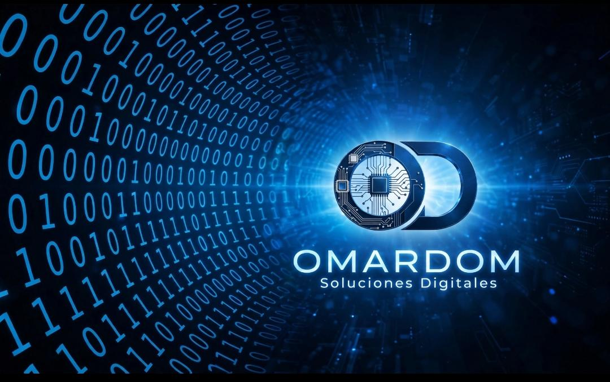
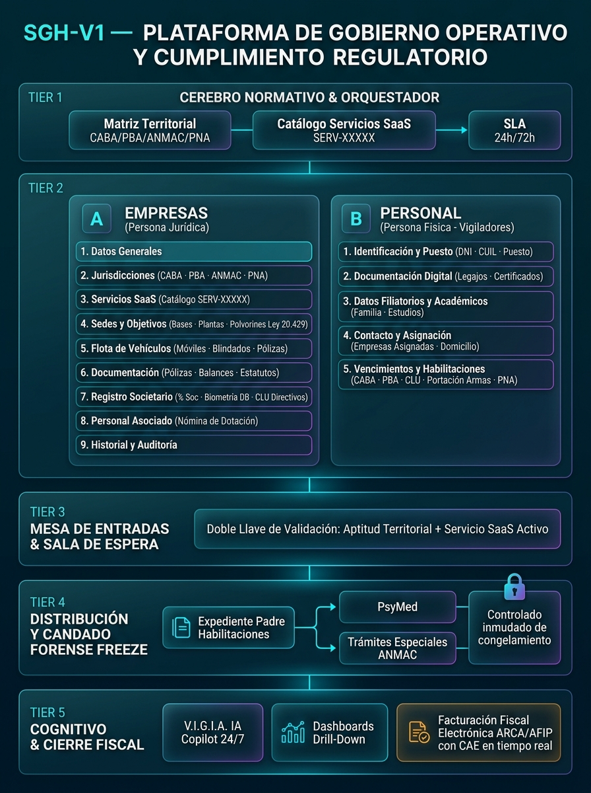
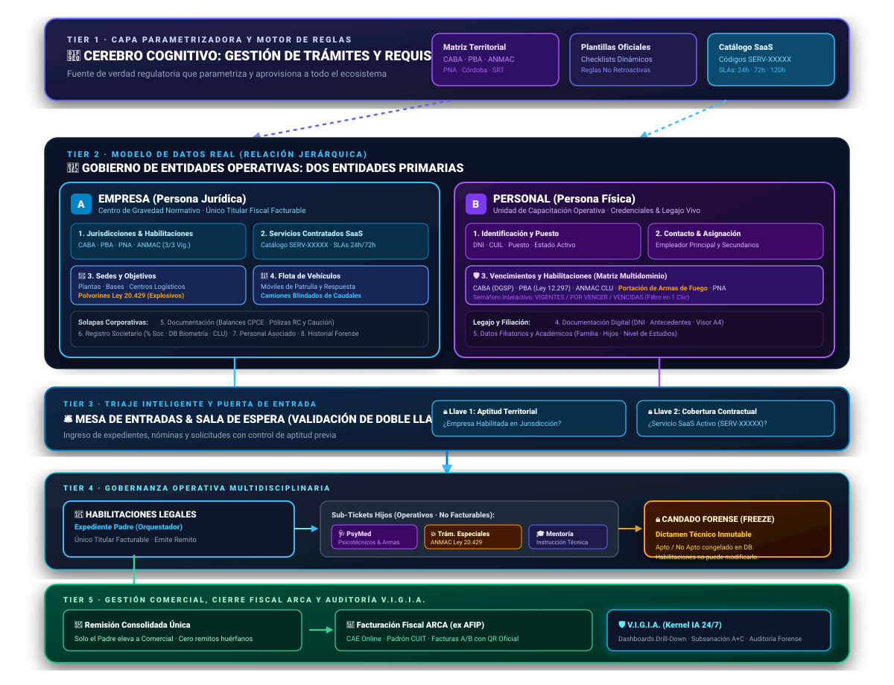
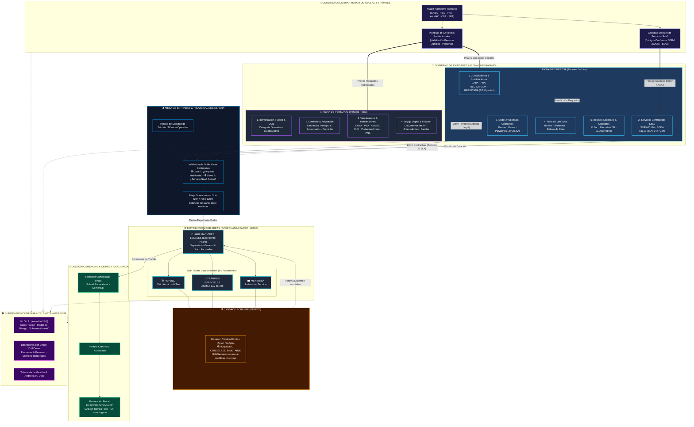

<p align="center">
  
</p>

<h1 align="center">🛡️ SGH-V1</h1>
<p align="center">
  <b>Ecosistema Enterprise de Compliance Regulatorio, Gobierno de Entidades (Empresa & Personal), Medicina Laboral (PsyMed), Materiales Controlados y Facturación Fiscal ARCA</b><br>
  <i>Plataforma Tecnológica Adaptable de Misión Crítica para Seguridad Corporativa, Minería, Oil & Gas, Logística de Caudales e Industrias Altamente Reguladas</i>
</p>

<p align="center">
  
  
  
  
  
  
  
  
  
  
</p>

---

## 📊 Métricas y Capacidad de la Plataforma en Producción

| Indicador Estratégico | Capacidad | Alcance Operativo |
| :--- | :---: | :--- |
| **Catálogo Maestro de Servicios** | **5 Líneas de Servicio** | Habilitaciones Legales, Medicina Laboral (PsyMed), Gobierno Corporativo, Mentoría Técnica y Trámites Especiales. |
| **Matrices Dinámicas de Trámites** | **Plantillas por Entidad, Rol y Gestión** | Checklists automatizados y no retroactivos por combinación de Entidad, Rol y Tipo de Gestión. |
| **Central de Comando Operativo** | **Dashboard 4x4 en Tiempo Real** | Seguimiento unificado para **Mesa de Entradas (Sala de Espera)**, **Empresas & Sedes Operativas**, **Personal & Legajos** y **Gestión Comercial**. |
| **Dimensiones de Gestión** | **2 Entidades Primarias** | Control normativo centralizado sobre **Empresa** y **Personal**, con solapas operativas para **Sedes/Objetivos** y **Flota/Vehículos** dentro del contexto de la empresa. |
| **Ámbitos Jurisdiccionales Auditados** | **Jurisdicciones Configurables** | Se configuran tantas jurisdicciones como ámbitos de trabajo tenga cada empresa o grupo de empresas, según lo defina quien gestiona. Preconfiguradas: CABA (DGSP), PBA (Ley 12.297), ANMAC / RENAR, PNA (Prefectura), PSA (Aeroportuaria), AUSA (Vial), Nacional (RNR) y Medicina Laboral / PsyMed. |
| **Módulo Hipersensible ANMAC** | **Ley Nacional N° 20.429** | Polvorines quinquenales, importación de explosivos, insumos de fractura Oil & Gas (tubing cutters, cargas huecas) y habilitación UPSV / comercio exterior. |
| **Integración Fiscal Oficial** | **ARCA (ex AFIP) en Vivo** | Consulta de padrón CUIT en tiempo real, emisión de Facturas A/B y Notas de Crédito con CAE y código QR oficial. |

---

## 🌟 Visión, Propósito y Adaptabilidad Universal

El **SGH-V1 (Sistema de Gestión de Habilitaciones - Versión 1)** es una plataforma de software de nivel industrial diseñada para gobernar la alta complejidad operativa, legal, regulatoria y documental de organizaciones que deben cumplir normas estrictas bajo presión constante.

### 🎯 El Doble Horizonte de Mercado de SGH-V1:

```text
┌─────────────────────────────────────────────────────────────────────────────────┐
│                    EL DOBLE HORIZONTE DE MERCADO DE SGH-V1                      │
├───────────────────────────────────────┬─────────────────────────────────────────┤
│  1. QUIENES NECESITAN CONTROLAR       │  2. QUIENES DESEAN CONTROLAR            │
│     (Cumplimiento Bajo Presión)       │     (Gobernanza Proactiva)              │
│  - Seguridad Privada y Caudales       │  - Logística de Cargas Peligrosas       │
│  - Yacimientos Oil & Gas (Fractura)   │  - Industria Farmacéutica & Química     │
│  - Minería y Canteras (Explosivos)    │  - Constructoras & Obras de Gran Porte  │
│  - Sedes Portuarias e Hidrovías (PNA) │  - Sanatorios & Complejos de Salud      │
│                                       │                                         │
│ "Empresas bajo constante fiscalización│   "Organizaciones que buscan elevar     │
│  que no pueden arriesgarse a una      │  estándares, certificar normas ISO      │
│  clausura, suspensión o multa federal"│  y no encuentran herramientas a medida" │
└───────────────────────────────────────┴─────────────────────────────────────────┘
```

**SGH-V1 fue forjado resolviendo los escenarios regulatorios más extremos del país:**  
Desde autorizaciones de comercio exterior de explosivos y polvorines petroleros hasta miles de credenciales individuales con portación de armas y exámenes psicofísicos rigurosos.  
Esa misma robustez arquitectónica —basada en **matrices dinámicas de requisitos y checklists no retroactivos**— le permite **adaptarse de forma natural a cualquier industria que exija gobernar procesos regulados, riesgo reputacional, documentación legal y cumplimiento operativo**.

---

## 🗺️ Mapa Estratégico del Ecosistema SGH‑V1

> ### 💡 *«Desde el cumplimiento normativo hasta la facturación fiscal, todo gestionado desde una única plataforma.»*  
> **SGH‑V1 es una plataforma de gobierno operativo y cumplimiento regulatorio para organizaciones de alta complejidad.**  
> Diseñada para unificar la gobernanza de **Empresa** y **Personal**, con solapas operativas para **Sedes / Objetivos**, **Flota / Vehículos**, documentación legal, historial y cierre fiscal, el sistema centraliza la trazabilidad, la auditoría y la ejecución regulatoria.

<p align="center">
  
</p>
<p align="center">
  <sub><b>Figura 1:</b> Torre de Control Empresarial SGH-V1 (1080 x 1350 px) — Los 5 niveles de gobierno con detalle exhaustivo de solapas operativas: Cerebro Normativo, Ficha Empresa (9 solapas) vs Ficha Personal (5 solapas), Mesa de Entradas Inteligente, Candado Freeze y Cierre Fiscal ARCA.</sub>
</p>

La arquitectura real del sistema no se basa en cuatro entidades paralelas y simétricas. La lógica de negocio y de datos se organiza en dos entidades primarias: **Empresa** y **Personal**. Las restantes áreas funcionales (sedes, objetivos, flotas, vehículos, activos operativos) son **solapas de gestión subordinadas a la empresa**, no entidades independientes del modelo base.

### ⚙️ Arquitectura Visual de Orquestación End-to-End

<p align="center">
  
</p>
<p align="center">
  <sub><b>Diagrama Vectorial Oficial:</b> Orquestación en capas de SGH-V1 — Cerebro Normativo, dos Entidades Primarias jerárquicas (Empresa con 9 solapas subordinadas y Personal con 5 solapas), Mesa de Entradas con Doble Llave, Gobernanza Padre-Hijos y Facturación Fiscal ARCA.</sub>
</p>

<details open>
<summary><b>🔍 Ver Diagrama Conceptual Mermaid (Detalle de Flujos de Código)</b></summary>
<br>


```mermaid
flowchart TD
    classDef brain fill:#1e1b4b,stroke:#6366f1,stroke-width:2px,color:#fff
    classDef entity fill:#1e3a5f,stroke:#38bdf8,stroke-width:2px,color:#fff
    classDef personal fill:#1e293b,stroke:#a855f7,stroke-width:2px,color:#fff
    classDef reception fill:#0f172a,stroke:#0284c7,stroke-width:2px,color:#fff
    classDef branch fill:#1e293b,stroke:#06b6d4,stroke-width:2px,color:#fff
    classDef lock fill:#451a03,stroke:#f59e0b,stroke-width:2px,color:#fff
    classDef commercial fill:#064e3b,stroke:#10b981,stroke-width:2px,color:#fff
    classDef supervisor fill:#3b0764,stroke:#d946ef,stroke-width:2px,color:#fff

    subgraph CEREBRO ["🧠 CEREBRO COGNITIVO: MOTOR DE REGLAS & TRÁMITES"]
        MR["Matriz Normativa Territorial<br/>(CABA · PBA · PNA · ANMAC · CBA · SRT)"]
        PT["Plantillas de Checklists Institucionales<br/>(Habilitación Persona Jurídica · Personal)"]
        CS["Catálogo Maestro de Servicios SaaS<br/>(Códigos Canónicos SERV-XXXXX · SLAs)"]
        MR --> PT
        MR --> CS
    end
    class MR,PT,CS,CEREBRO brain

    subgraph GOB_ENTIDADES ["🏢 GOBIERNO DE ENTIDADES & FICHAS OPERATIVAS"]
        subgraph EMPRESAS ["🏢 FICHA DE EMPRESA (Persona Jurídica)"]
            CARD_JUR["1. Jurisdicciones & Habilitaciones<br/>CABA · PBA: REGISTRADA · HABILITADA (3/3 Vigentes)"]
            CARD_SRV["2. Servicios Contratados SaaS<br/>SERV-00184 · SERV-01312 (SLA: 24h / 72h)"]
            CARD_SEDES["3. Sedes y Objetivos Operativos<br/>Plantas · Bases · Polvorines Ley 20.429"]
            CARD_FLOTA["4. Flota de Vehículos<br/>Móviles · Blindados · Pólizas de Flota"]
            CARD_SOC["5. Registro Societario & Contactos<br/>% Soc · Biometría DB · CLU Directivos"]
            CARD_JUR -.->|"Jurisdicción Requerida"| CARD_SRV
        end

        subgraph PERSONAL ["👤 FICHA DE PERSONAL (Persona Física)"]
            PER_ID["1. Identificación, Puesto & CUIL<br/>Categoría Operativa · Estado Activo"]
            PER_ASIG["2. Contacto & Asignación<br/>Empleador Principal & Secundarios · Domicilio"]
            PER_HAB["3. Vencimientos & Habilitaciones<br/>CABA · PBA · ANMAC CLU · Portación Armas · PNA"]
            PER_DOC["4. Legajo Digital & Filiación<br/>Documentación A4 · Antecedentes · Familia"]
        end
    end
    class GOB_ENTIDADES,EMPRESAS,CARD_JUR,CARD_SRV,CARD_SEDES,CARD_FLOTA,CARD_SOC entity
    class PERSONAL,PER_ID,PER_ASIG,PER_HAB,PER_DOC personal

    PT ==>|"Provee Checklists Oficiales"| CARD_JUR
    PT ==>|"Provee Requisitos Individuales"| PER_HAB
    CS ==>|"Provee Catálogo SERV-XXXXX"| CARD_SRV

    subgraph SALA ["🛎️ MESA DE ENTRADAS & TRIAJE: SALA DE ESPERA"]
        VAL["Validación de Doble Llave Corporativa<br/>🔒 Llave 1: ¿Empresa Habilitada? · 🔒 Llave 2: ¿Servicio SaaS Activo?"]
        SE["Ingreso de Solicitud de Trámite / Nómina Operativa"]
        TR["Triaje Operativo con SLA (24h / 72h / 120h)<br/>Balanceo de Carga entre Analistas"]
        SE --> VAL --> TR
    end
    class VAL,SE,TR,SALA reception

    CARD_JUR -->|"Llave Territorial (Aptitud Legal)"| VAL
    CARD_SRV -->|"Llave Contractual (Servicio & SLA)"| VAL
    PER_ASIG -.->|"Vínculo de Dotación"| VAL

    subgraph AREAS ["⚙️ DISTRIBUCIÓN POR ÁREAS (GOBERNANZA PADRE - HIJOS)"]
        HAB["📁 HABILITACIONES LEGALES (Expediente Padre)<br/>Orquestador General & Único Facturable"]

        subgraph HIJOS ["Sub-Tickets Especializados (No Facturables)"]
            PSY["🩺 PSYMED<br/>Psicotécnicos & Tiro"]
            TE["💥 TRÁMITES ESPECIALES<br/>ANMAC Ley 20.429"]
            MEN["🎓 MENTORÍA<br/>Instrucción Técnica"]
        end

        HAB --> PSY
        HAB --> TE
        HAB --> MEN
    end
    class HAB,PSY,TE,MEN,AREAS branch

    TR -->|"Deriva Expediente Padre"| HAB

    subgraph CANDADO ["🔒 CANDADO FORENSE (FREEZE)"]
        FZ["Dictamen Técnico Emitido (Apto / No Apto)<br/>🔒 REQUISITO CONGELADO INMUTABLE<br/>Habilitaciones no puede modificar ni sortear"]
    end
    class FZ,CANDADO lock

    PSY --> FZ
    TE --> FZ
    MEN --> FZ
    FZ -->|"Retorna Dictamen Inmutable"| HAB

    subgraph COMERCIAL ["💼 GESTIÓN COMERCIAL & CIERRE FISCAL (ARCA)"]
        REM["Remisión Consolidada Única<br/>(Solo el Padre eleva a Comercial)"]
        REM_AUT["Remito Comercial Autorizado"]
        ARCA["Facturación Fiscal Electrónica ARCA (AFIP)<br/>CAE en Tiempo Real + QR Homologado"]
        REM --> REM_AUT --> ARCA
    end
    class REM,REM_AUT,ARCA,COMERCIAL commercial

    HAB -->|"Conclusión de Trámite"| REM

    subgraph SUPERVISION ["🛡️ SUPERVISIÓN CONTINUA & TELEMETRÍA FORENSE"]
        VIGIA["V.I.G.I.A. (Kernel IA 24/7)<br/>Cero Fricción · Radar de Riesgo · Subsanación A+C"]
        DASH["Dashboards con Visual Drill-Down<br/>Empresas & Personal · Matrices Territoriales"]
        TEL["Telemetría de Gestión & Auditoría 90 Días"]
    end
    class VIGIA,DASH,TEL,SUPERVISION supervisor

    CEREBRO -.-> SUPERVISION
    GOB_ENTIDADES -.-> SUPERVISION
    AREAS -.-> SUPERVISION
    COMERCIAL -.-> SUPERVISION
```

</details>

### 📋 Desglose Exhaustivo de Solapas de Gestión Operativa

| Entidad Primaria | Solapa Operativa | Propósito, Datos Clave & Flujo Normativo |
| :--- | :--- | :--- |
| **🏢 EMPRESA** *(Persona Jurídica)* | **1. Datos Generales** | Razón social, CUIT, Domicilio Legal CABA/PBA, Domicilio Real, contacto corporativo y estado en el sistema. |
| **🏢 EMPRESA** | **2. Jurisdicciones y Habilitaciones** | Inscripción y habilitación por autoridad reguladora (CABA, PBA, PNA, ANMAC). Checklists institucionales y semáforos de vigencia en tiempo real. |
| **🏢 EMPRESA** | **3. Servicios Contratados (SaaS)** | Catálogo de servicios suscriptos (`SERV-XXXXX`) condicionados a la jurisdicción activa previa. SLAs acordados (24h/72h/120h) y aranceles contractuales. |
| **🏢 EMPRESA** | **4. Sedes y Objetivos** | Gestión integral de dependencias e inmuebles: Plantas industriales, agencias, bases logísticas y **Polvorines Quinquenales regulados por ANMAC Ley 20.429**. |
| **🏢 EMPRESA** | **5. Flota de Vehículos** | Parque automotor táctico y de custodia: Móviles de patrulla, **unidades blindadas de caudales**, inspección técnica, pólizas de seguro de flota y control de vigencias. |
| **🏢 EMPRESA** | **6. Documentación** | Repositorio documental legal corporativo: Estatuto social, actas de asamblea, balances certificados por CPCECABA/PBA, pólizas de caución y de responsabilidad civil. |
| **🏢 EMPRESA** | **7. Registro Societario y Contactos** | Directorio y socios: Nómina, porcentaje accionario (`% Soc.`), teléfonos, emails, **Datos Biométricos (`DB`)** y control de vencimientos. |
| **🏢 EMPRESA** | **8. Personal Asociado** | Nómina viva del personal asignado a la empresa: Vigiladores, supervisores y custodias, con acceso directo a sus respectivas fichas técnicas. |
| **🏢 EMPRESA** | **9. Historial** | Registro inmutable de auditoría forense con trazabilidad de altas, modificaciones societarias y cambios de estado regulatorio. |
| **👤 PERSONAL** *(Persona Física)* | **1. Identificación y Puesto** | DNI, CUIL, Apellido, Nombre, sexo, puesto/función (Vigilador General VA, Custodia, etc.), empresa asignada y estado (Activo, Inactivo, Observado). |
| **👤 PERSONAL** | **2. Documentación Digital** | Legajo digital unificado: DNI digitalizado, analítico de estudios, certificados de antecedentes con visor embebido, descarga y reimpresión en formato oficial. |
| **👤 PERSONAL** | **3. Datos Filiatorios y Académicos** | Filiación paterna y materna, cónyuge, cantidad de hijos, estado civil y máximo nivel de instrucción formal alcanzado. |
| **👤 PERSONAL** | **4. Contacto y Asignación** | Historial de asignaciones a empresas (distinción de Empleador Principal vs. secundarios, altas/bajas), domicilio legal/real con geolocalización, datos de contacto. |
| **👤 PERSONAL** | **5. Vencimientos y Habilitaciones** | Matriz multidominio de credenciales y aptitudes: CABA, PBA (Ley 12.297), ANMAC / RENAR CLU, **Portación de armas de fuego**, Seguridad Patrimonial, PNA y otros ámbitos. |

### 🔄 Los Seis Flujos Cardinales de la Orquestación Enterprise:

1. **El Cerebro Normativo como Proveedor Maestro de Datos (Trámites y Requisitos):**  
   El Módulo de **Gestión de Trámites y Requisitos** es el **Cerebro Cognitivo y Parametrizador Central** del ecosistema. Governa y mantiene vivas dos fuentes de verdad:
   - *Matriz Regulatoria Territorial & Plantillas Oficiales:* Define los requisitos jurídicos para cada autoridad de aplicación (**CABA, PBA, PNA, ANMAC, Córdoba, SRT** y todas las que cada empresa o grupo necesite incorporar).
   - *Catálogo Unificado de Servicios SaaS:* Parametriza cada prestación con su código canónico (`SERV-XXXXX`), ámbito territorial, área técnica responsable, costos, aranceles base y tiempos de servicio.

2. **Aprovisionamiento y Gobierno en Módulo Empresas (La Doble Llave Corporativa):**  
   El Módulo Trámites/Requisitos nutre de manera directa y vinculante las solapas operativas centrales de la **Ficha de Empresa**:
   - **Solapa `JURISDICCIONES Y HABILITACIONES`:** Al accionar `+ ASIGNAR JURISDICCIÓN`, el modal consulta al Cerebro y despliega los organismos reguladores disponibles junto a sus plantillas oficiales configuradas.
   - **Solapa `SERVICIOS CONTRATADOS (SaaS)`:** Bajo la condición ineludible de contar con una jurisdicción activa previa, el botón `+ ASIGNAR SERVICIO` abre el catálogo maestro filtrado por ese territorio.
   - **Solapas de Gestión Físico-Operativa (`SEDES Y OBJETIVOS` y `FLOTA DE VEHÍCULOS`):** Las plantas operativas, polvorines quinquenales y móviles blindados no flotan de manera aislada; son solapas directas de gobierno dentro de cada Empresa, vinculadas a sus respectivas habilitaciones.

3. **Mesa de Entradas & Sala de Espera (Validación de Doble Llave Operativa):**  
   Cuando un cliente o gestor ingresa una solicitud de trámite o personal a la **Sala de Espera**, el motor valida estrictamente la **Doble Llave Corporativa**:
   - 🔒 **Llave 1 (Aptitud Territorial):** ¿La empresa está formalmente registrada y habilitada en la jurisdicción correspondiente?
   - 🔒 **Llave 2 (Cobertura Contractual):** ¿La empresa tiene contratado y activo el servicio SaaS específico (`SERV-XXXXX`)?  
   Si alguna llave falla, el sistema bloquea el ingreso o V.I.G.I.A. emite alerta crítica inmediata de desvío normativo. Si ambas son válidas, la solicitud adopta el SLA contratado y entra a la cola operativa.

4. **Gobierno Jerárquico Padre-Hijos (Habilitaciones vs. Áreas Técnicas Subsidiarias):**  
   Habilitaciones actúa como el **Expediente Padre orquestador** y único titular facturable (`es_facturable = True`). Cuando el trámite demanda intervenciones multidisciplinarias, el sistema deriva sub-tickets especializados.

5. **Candado de Congelamiento Forense (Freeze 🔒):**  
   Garantía de integridad legal absoluta. Una vez que el perito o profesional de salud emite su dictamen técnico (*Apto, No Apto, Observado*), el casillero correspondiente queda **congelado con candado forense** y no puede modificarse ni sortearse.

6. **Remisión Consolidada a Gestión Comercial & Facturación Fiscal ARCA:**  
   Prohibición absoluta de remitos o facturas huérfanas. Solo el expediente Padre concluido (aprobado o cerrado por dictamen de rechazo técnico) tiene la potestad de remitir la gestión a **Gestión Comercial y Facturación Fiscal**.

---

## 🛡️ V.I.G.I.A. — Motor de Inteligencia Artificial (Kernel IA)

<p align="center">
  
</p>
<p align="center">
  <b>V.I.G.I.A.</b> (<b>V</b>erificador <b>I</b>nteligente de <b>G</b>estiones, <b>I</b>ncidencias y <b>A</b>cciones) es el motor de Inteligencia Artificial de <b>SGH-V1</b>.<br>
  <i>«Transforma información en seguimiento, alertas y acciones»</i>
</p>

### 💡 Propósito, Acrónimo y Definiciones Oficiales:
- **Acrónimo Canónico:** **V.I.G.I.A.** (**V**erificador **I**nteligente de **G**estiones, **I**ncidencias y **A**cciones).
- **Definición Corporativa:** *V.I.G.I.A. es el motor de Inteligencia Artificial de SGH-V1 encargado de supervisar, analizar y dar seguimiento a gestiones, incidencias, documentación, habilitaciones, estados regulatorios y alertas críticas.*
- **Definición Ejecutiva:** *«V.I.G.I.A. transforma información en seguimiento, alertas y acciones.»*
- **Definición Técnica:** *V.I.G.I.A. actúa como una capa inteligente de monitoreo y asistencia operacional que analiza estados, eventos, documentos, alertas y flujos de trabajo para detectar incidencias, priorizar tareas y guiar decisiones de subsanación.*
- **Denominación en Frontend:** En todo el frontend de SGH-V1 figura formalmente como la sigla **`V.I.G.I.A.`** (o su forma extendida **`V.I.G.I.A. — Verificador Inteligente de Gestiones, Incidencias y Acciones`**).

### 🎯 La Ley de Oro de V.I.G.I.A.: "Cero Fricción" (Zero Friction)
> **"V.I.G.I.A. NUNCA DEBE SER UN MERO CARTEL INFORMATIVO QUE OBLIGA AL USUARIO A SALIR A BUSCAR.  
> TODA ALERTA DE V.I.G.I.A. CONDUCE DIRECTAMENTE A LA SOLUCIÓN O ENTREGA EL INSTRUMENTO PARA RESOLVER EN EL ACTO."**

### ⚡ Capacidades Principales y Flujos Operativos:

1. **Resolución de Alertas a Escala (Estrategia Óptima A + C):**  
   Ante contingencias masivas (ej. 300 legajos con perfil incompleto o empresas observadas), V.I.G.I.A. no satura al operador:
   - **Opción A (Filtro Inteligente en 1 Clic):** Aísla de inmediato en la grilla los registros observados para corrección ágil.
   - **Opción C (Planilla de Subsanación Masiva):** Si el volumen es elevado ($\ge 50$ registros), V.I.G.I.A. ofrece descargar con 1 clic una planilla CSV pre-formateada con **UTF-8 BOM (`\uFEFF`)** y columnas normalizadas para alta productividad.
   - **Accionabilidad Directa:** Toda sugerencia incorpora botones directos: `[ 📝 Ficha Personal ]`, `[ 🏢 Ver Ficha Empresa ]`, `[ 🔍 Filtrar Observados ]` y `[ 📥 Exportar Planilla ]`.

2. **Inspector Cero-Invasivo (HUD Holográfico & Scanning):**
   - Atajo global: `F1` o `Ctrl + Espacio` en cualquier parte del sistema.
   - Activando el modo **Inspector**, el operador posa el mouse sobre cualquier campo anotado con `data-kernel-cell="..."` y V.I.G.I.A. proyecta un halo cian holográfico.
   - Al hacer clic, abre instantáneamente la pestaña **Celdas & Inputs** enseñando: qué es el campo, qué formato estricto exige, qué impacto normativo tiene y qué roles RBAC tienen permiso para editarlo.

3. **Los 8 Pilares Cognitivos en Tiempo Real:**
   - **Pilar 1 - Sector & SOP:** Contexto del módulo activo y Procedimiento Operativo Estándar paso a paso.
   - **Pilar 2 - Mi Rol & RBAC:** Perfil del usuario activo y alcance normativo de su función.
   - **Pilar 3 - Matriz de Permisos:** Visualización de acciones autorizadas vs restringidas.
   - **Pilar 4 - Diccionario de Celdas:** Explicación funcional y jurídica de cada campo del formulario.
   - **Pilar 5 - Diagnóstico Vivo:** Evaluación en servidor con dictamen (`OPERATIVO`, `CON_OBSERVACIONES`, `BLOQUEADO`).
   - **Pilar 6 - Trazabilidad Operativa:** Días de permanencia por sector y detección de cuellos de botella.
   - **Pilar 7 - Micro-Acciones de 1 Clic:** Acciones inmediatas para resolver observaciones sin salir de la pantalla.
   - **Pilar 8 - Radar de Riesgo & Auditoría:** Marco legal aplicable y exportación de reportes forenses en PDF.

---

## 🏛️ Los Pilares Cardinales de SGH-V1

### 1. 🎛️ Dashboard de Gestión: Central de Comando Operativo
- **Mesa de Entradas (Sala de Espera):** Cola dinámica con balanceo de carga entre operadores técnicos y subsanación ágil.
- **Empresas & Sedes Operativas:** Semáforo general de habilitaciones corporativas (`Habilitada`, `En Trámite`, `En Riesgo`, `Vencida`, `Suspendida`).
- **Personal & Aptitudes Ocupacionales:** Control en tiempo real de nómina activa, credenciales, antecedentes RNR y aptos médicos PsyMed.
- **Gestión Comercial & Facturación Fiscal:** Circuito de remitos de entrega, autorizaciones gerenciales y facturación fiscal electrónica con CAE.

### 2. 🏢👤 Gobierno Integral de Entidades (Fichas Operativas Empresa & Personal)

SGH-V1 centraliza la gobernanza operativa y contractual en **dos entidades primarias indivisibles**, garantizando coherencia normativa y eliminando la dispersión de datos:

- **🏢 Ficha Empresa (Persona Jurídica):** Centro de gravedad contractual y fiscal. Punto único de facturación y gobierno integral de activos. En lugar de dispersar la gestión en entidades aisladas, la empresa gobierna de manera jerárquica y subordinada sus **Sedes y Objetivos** (plantas, agencias, bases logísticas y polvorines Ley 20.429), su **Flota de Vehículos** (blindados de caudales y patrullas con inspección técnica y seguros de flota), su documentación legal y sus habilitaciones multi-jurisdiccionales (CABA, PBA, PNA, ANMAC).
- **👤 Ficha Personal (Persona Física):** Unidad operativa, de aptitud psicofísica y legajo digital inmutable. Control centralizado de antecedentes (RNR), aptitudes médicas (PsyMed) y una **matriz multidominio de credenciales y habilitaciones de armas** auditada con semáforos de vigencia en tiempo real.
- **🔗 Vinculación Laboral Flexible ($n:m$):** Permite que un operador esté asignado a múltiples empresas bajo esquemas de empleador principal y empleadores secundarios, preservando el historial forense y la inmutabilidad de sus habilitaciones sin duplicar legajos.

### 3. 💥 Módulo de Materiales Controlados (Ley Nacional N° 20.429 / ANMAC)
- **Polvorines Quinquenales:** Control de vigencias a 5 años, capacidades de almacenamiento en kilos/toneladas de explosivos y detonadores.
- **Comercio Exterior:** Formularios FDT 7, autorizaciones de importación/exportación de explosivos e insumos de fractura hidráulica petrolera (*Tubing Cutters*, cargas huecas, cordón detonante).
- **Servicios de Voladura:** Inscripción y control de UPSV para minería y canteras.

### 4. 🩺 Salud Ocupacional & Medicina Laboral (PsyMed)
- Catálogo de **471 servicios especializados**.
- Informes psicotécnicos por nivel de responsabilidad (Operativo, Mandos Medios, Directivo).
- Exámenes psicofísicos para portación y uso de armas con certificación ministerial.

### 5. 💼 Facturación Fiscal Homologada ARCA (ex AFIP)
- Emisión nativa de **Facturas A/B y Notas de Crédito** vinculadas al remito comercial autorizado.
- Conexión online vía Web Services (WSAA + WSFEv1) con obtención instantánea de **CAE** y renderizado de comprobante PDF con **código QR oficial**.
- Validación de CUIT en tiempo real mediante consulta al Padrón A13.
- Arquitectura 100% idempotente (cero duplicaciones fiscales).

---

## 💻 Stack Tecnológico de Grado Industrial

| Capa | Tecnología | Características Clave |
| :--- | :--- | :--- |
| **Frontend** | **React 19 + Vite + Tailwind CSS** | SPA modular, reactiva, ultrarrápida, Dashboard 4x4 y consola de copiloto V.I.G.I.A. |
| **Backend** | **FastAPI (Python 3.12)** | API asíncrona de alto rendimiento, OpenAPI interactivo y arquitectura desacoplada por dominios. |
| **Integración Fiscal** | **ARCA / AFIP Web Services** | Criptografía X.509 (CMS/PKCS#7), obtención de CAE y emisión en tiempo real. |
| **Persistencia** | **PostgreSQL 16 + SQLAlchemy 2.0** | Modelado estricto con claves foráneas, auditoría forense inmutable y migraciones con Alembic. |
| **Seguridad** | **JWT + RBAC + Multi-Tenant** | Cifrado Bcrypt, aislamiento total por empresa y permisos por matriz de roles. |
| **Infraestructura** | **Servidor Dedicado** | 100% Self-Hosted, proxy reverso con TLS y consola de telemetría **NOC-PANEL**. |

---

## 🔒 Soberanía de Datos e Independencia Tecnológica

SGH-V1 es **100% Self-Hosted** en servidor dedicado corporativo:
- **Cero dependencia de nubes públicas de terceros** (sin almacenamiento en Vercel, Supabase o Railway).
- **Control y Soberanía Total:** Toda la base de datos relacional, los legajos médicos confidenciales, los registros balísticos y las credenciales fiscales residen en infraestructura soberana y bajo propiedad del cliente.
- **Política de Privacidad y Cumplimiento Zero-Leak (NDA):** Toda la información corporativa, legajos y operaciones de clientes se gestionan bajo estricta confidencialidad. Este showcase no expone nombres de clientes, URLs internas, correos corporativos ni credenciales; todo dato operativo mostrado es ilustrativo.

---

## 🤝 Adaptación a Nuevos Sectores & Alianzas Comerciales

¿Su organización opera en una industria con requerimientos regulatorios complejos o desea implementar un estándar de gobernanza proactiva?

**SGH-V1 es un motor adaptable.** Diseñamos matrices de trámites personalizadas para:
- 🚚 **Transporte y Cargas Peligrosas** (Vencimientos de flota, licencias, rutas y seguros).
- 💊 **Industria Farmacéutica, Química y Bioquímica** (Trazabilidad y fiscalizaciones sanitarias).
- 🏗️ **Construcción y Minería Pesada** (Aptitudes laborales masivas y control de maquinaria).
- 🏥 **Complejos Médicos y Sanatoriales** (Acreditaciones profesionales y equipamiento médico).

**Contacto Institucional & Alianzas Estratégicas:**
- **Dirección de Proyecto:** Omar A. Domínguez — *OMARDOM Soluciones Digitales*
- **Showcase Oficial en GitHub:** [https://github.com/Omar1963/SGH-V1-Showcase](https://github.com/Omar1963/SGH-V1-Showcase)
- **LinkedIn:** [Perfil Oficial de Omar Domínguez](https://www.linkedin.com/in/omar-dominguez-sghv1/)
- **Contacto Profesional:** Mensaje Directo vía LinkedIn o solicitud de briefing técnico privado a través de OMARDOM Soluciones Digitales.

---

<p align="center">
  <b>SGH-V1</b> — <i>Tecnología, Precisión y Soberanía al servicio de las Industrias Estratégicas y el Cumplimiento Universal.</i><br>
  <sub>Desarrollado con el sello de calidad de <b>OMARDOM Soluciones Digitales</b>. Buenos Aires, Argentina.</sub>
</p>
