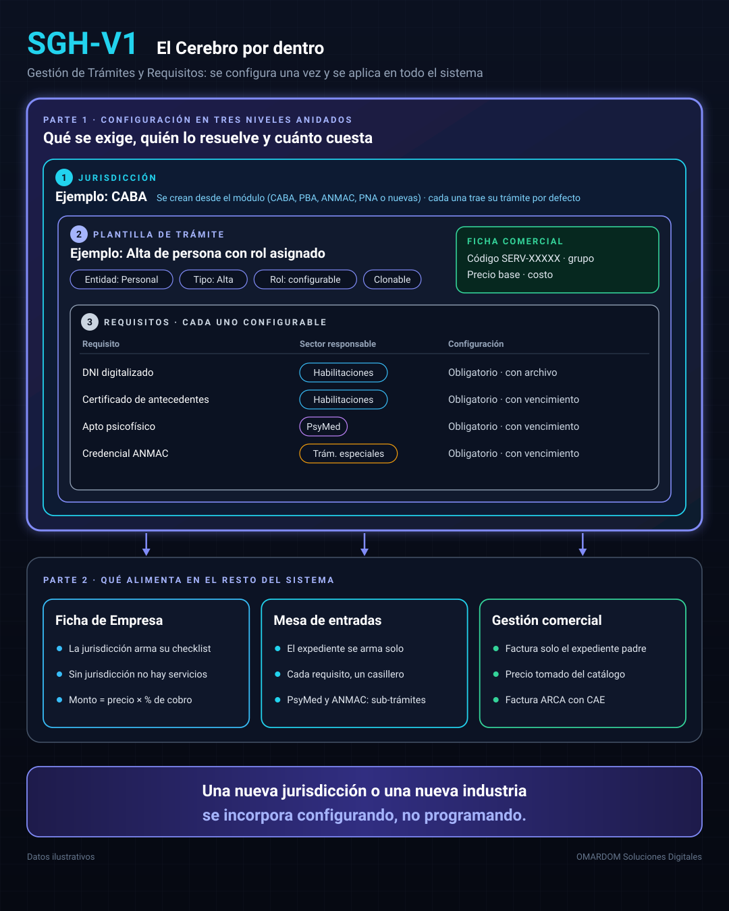

  

<h1 align="center">🛡️ SGH-V1</h1>

  <b>Plataforma de gobierno operativo y cumplimiento regulatorio para industrias fiscalizadas.</b> 
  Habilitaciones, credenciales, vencimientos y facturación fiscal de empresas y su personal, en todas las jurisdicciones donde operan, 
  con un motor de IA (<b>V.I.G.I.A.</b>) que avisa antes de que algo venza y lleva directo a la solución.

  
  
  
  
  

  <a href="https://www.linkedin.com/in/omar-dominguez-sghv1/"><b>💬 Coordinar un briefing</b></a> ·
  <a href="docs/vigia_dossier_tecnico_marketing.md"><b>🧠 Dossier técnico de V.I.G.I.A.</b></a> ·
  <a href="#arquitectura"><b>🗺️ Arquitectura</b></a>

---

## ⚠️ El problema

En seguridad privada, minería, Oil & Gas, logística de caudales y otras industrias fiscalizadas, **operar depende de estar habilitado**. Y estar habilitado depende de cientos de requisitos que:

- **están dispersos** entre varios organismos (CABA, PBA, ANMAC, Prefectura, PSA, SRT…), cada uno con sus propias reglas;
- **vencen en fechas distintas** y se cruzan entre personas, empresas, sedes y vehículos;
- **se controlan en planillas y carpetas**, hasta el día en que un vencimiento que nadie vio se convierte en una multa, una suspensión o una clausura.

---

## ✅ Qué resuelve SGH-V1

| Necesidad | Cómo la resuelve SGH-V1 |
| :--- | :--- |
| **Saber qué vence y cuándo** | Semáforos de vigencia en tiempo real y alertas preventivas con 30 días de anticipación. |
| **Operar en varias jurisdicciones** | Matriz normativa configurable: se cargan tantas jurisdicciones como ámbitos de trabajo tenga cada empresa o grupo de empresas. |
| **Que no entre un trámite que no corresponde** | Mesa de entradas con **Doble Llave**: valida que la empresa esté registrada en la jurisdicción y que tenga el servicio contratado. |
| **Dictámenes que nadie pueda alterar** | **Candado forense**: una vez emitido el dictamen técnico (Apto / No Apto), queda congelado. |
| **Corregir cientos de legajos a la vez** | V.I.G.I.A. filtra los observados en 1 clic o genera la planilla de subsanación para Excel y la vuelve a importar. |
| **Facturar sin errores fiscales** | Facturación electrónica ARCA (ex AFIP) con CAE en línea, código QR oficial y cero duplicaciones. |

---

## 🎯 Para quién

| 1. Quienes **necesitan** controlar | 2. Quienes **desean** controlar |
| :--- | :--- |
| *Empresas bajo fiscalización constante, que no pueden arriesgarse a una clausura, suspensión o multa.* | *Organizaciones que buscan elevar su estándar, certificar normas ISO y no encuentran herramientas a medida.* |
| Seguridad privada y transporte de caudales | Logística de cargas peligrosas |
| Oil & Gas (insumos de fractura, polvorines) | Industria farmacéutica y química |
| Minería y canteras (explosivos, voladura) | Construcción y obras de gran porte |
| Puertos e hidrovías (PNA) | Sanatorios y complejos de salud |

SGH-V1 nació resolviendo los escenarios regulatorios más exigentes del país: comercio exterior de explosivos, polvorines petroleros y miles de credenciales con portación de armas y exámenes psicofísicos. Esa misma base, **matrices dinámicas de requisitos y checklists no retroactivos**, le permite adaptarse a cualquier actividad que deba gobernar personas, empresas, sedes, flotas y vencimientos cruzados.

---

## 🗺️ Cómo está organizado

Todo parte del **Cerebro del sistema, la Gestión de Trámites y Requisitos**: define qué se exige, qué se presta y cuánto cuesta, y **provee a cada nivel** los checklists, las jurisdicciones, los requisitos, las áreas responsables y los aranceles. Cada expediente recorre así **cinco niveles controlados**, de la norma a la factura, bajo la supervisión continua de V.I.G.I.A.:

  

El modelo se apoya en **dos entidades primarias**:

- **🏢 Empresa (persona jurídica):** centro contractual y fiscal. Gobierna, como solapas propias, sus **jurisdicciones y habilitaciones**, **servicios contratados**, **sedes y objetivos** (plantas, bases, polvorines), **flota de vehículos**, documentación, registro societario, personal asociado e historial. *(9 solapas)*
- **👤 Personal (persona física):** identificación y puesto, documentación digital, datos filiatorios, contacto y asignación, y una **matriz de vencimientos y habilitaciones** (CABA, PBA, ANMAC, portación de armas, PNA y otras). *(5 solapas)*
- **🔗 Vinculación flexible:** una persona puede estar asignada a varias empresas (empleador principal y secundarios) sin duplicar su legajo.

### 🧠 El Cerebro: de la norma al servicio facturable

La **Gestión de Trámites y Requisitos** se configura en tres niveles anidados:

1. **Jurisdicción:** se crean desde el módulo (CABA, PBA, ANMAC, PNA o las que cada empresa necesite), y cada una trae su trámite por defecto.
2. **Plantilla de trámite:** por ejemplo, "Alta de persona con rol asignado" (chofer de transporte de caudales, operador de monitoreo, responsable logístico, administrativo, etc.). Define a qué entidad aplica (empresa, personal, sede o vehículo), el tipo de trámite y el rol, y tiene su **ficha comercial**: código `SERV-XXXXX`, precio base y costo. Se puede clonar para otra jurisdicción.
3. **Requisitos:** cada uno configurable (obligatorio, con archivo, con vencimiento y vigencia) y con su **sector responsable**: Habilitaciones, PsyMed o Trámites especiales.

Con esa configuración, el resto del sistema trabaja solo:

- **Ficha de Empresa:** al asignar una jurisdicción se genera su checklist. **Sin jurisdicción no se pueden contratar servicios**, y el monto de cada servicio es el precio del catálogo por el porcentaje de cobro de la empresa.
- **Mesa de entradas:** el expediente se arma automáticamente; cada requisito es un casillero, y los que corresponden a PsyMed o Trámites especiales generan sub-trámites en esas áreas.
- **Gestión comercial:** se factura solo el expediente padre, con el precio del catálogo y factura ARCA con CAE.

  

> **Una nueva jurisdicción o una nueva industria se incorpora configurando, no programando.**

<b>📋 Ver el detalle de solapas de Empresa y Personal</b>

 

| Entidad | Solapa | Qué gestiona |
| :--- | :--- | :--- |
| 🏢 Empresa | 1. Datos Generales | Razón social, CUIT, domicilios legal y real, contacto y estado en el sistema. |
| 🏢 Empresa | 2. Jurisdicciones y Habilitaciones | Inscripción y habilitación por organismo, con checklists y semáforos de vigencia. |
| 🏢 Empresa | 3. Servicios Contratados | Servicios del catálogo (`SERV-XXXXX`), condicionados a una jurisdicción activa, con su SLA. |
| 🏢 Empresa | 4. Sedes y Objetivos | Plantas, agencias, bases logísticas y **polvorines regulados por ANMAC (Ley 20.429)**. |
| 🏢 Empresa | 5. Flota de Vehículos | Móviles, **unidades blindadas de caudales**, inspección técnica y pólizas. |
| 🏢 Empresa | 6. Documentación | Estatuto, actas, balances certificados, pólizas de caución y de responsabilidad civil. |
| 🏢 Empresa | 7. Registro Societario y Contactos | Directorio y socios, porcentaje accionario y vencimientos. |
| 🏢 Empresa | 8. Personal Asociado | Nómina asignada a la empresa, con acceso directo a cada ficha. |
| 🏢 Empresa | 9. Historial | Registro inmutable de altas, modificaciones y cambios de estado regulatorio. |
| 👤 Personal | 1. Identificación y Puesto | DNI, CUIL, puesto o función, empresa asignada y estado (Activo, Inactivo, Observado). |
| 👤 Personal | 2. Documentación Digital | Legajo digital: DNI, estudios y certificados de antecedentes con visor integrado. |
| 👤 Personal | 3. Datos Filiatorios y Académicos | Grupo familiar, estado civil y nivel de instrucción. |
| 👤 Personal | 4. Contacto y Asignación | Historial de asignaciones a empresas (principal y secundarias) y domicilios. |
| 👤 Personal | 5. Vencimientos y Habilitaciones | Matriz de credenciales y aptitudes: CABA, PBA (Ley 12.297), ANMAC, **portación de armas**, PNA y otras. |

<b>🔄 Ver los seis flujos de la orquestación</b>

 

1. **Cerebro normativo:** el módulo de Trámites y Requisitos es la fuente de verdad. Define los requisitos de cada organismo y el catálogo de servicios con sus SLAs, aranceles y área responsable.
2. **Doble aprovisionamiento de la empresa:** primero se le asigna una jurisdicción (con sus plantillas oficiales) y, sólo con una jurisdicción activa, los servicios de ese territorio.
3. **Mesa de entradas con Doble Llave:** cada solicitud se valida contra el registro de la empresa en la jurisdicción y el servicio contratado. Si una llave falla, el ingreso se bloquea y V.I.G.I.A. alerta el desvío.
4. **Gobierno padre-hijos:** Habilitaciones es el expediente padre y único facturable; deriva sub-tickets a PsyMed, Trámites Especiales o Mentoría.
5. **Candado forense:** el dictamen técnico (Apto / No Apto / Observado) queda congelado y no puede modificarse.
6. **Cierre comercial y fiscal:** sólo el expediente padre concluido genera remito y factura. No existen remitos ni facturas huérfanas.

---

## 🛡️ V.I.G.I.A. — Motor de Inteligencia Artificial

  

**V.I.G.I.A.** (**V**erificador **I**nteligente de **G**estiones, **I**ncidencias y **A**cciones) supervisa en forma continua gestiones, documentación, habilitaciones y estados regulatorios. *Transforma información en seguimiento, alertas y acciones.*

> **Ley de Cero Fricción:** una alerta de V.I.G.I.A. nunca es un cartel que obliga a salir a buscar. Siempre lleva directo a la solución o entrega el instrumento para resolverla en el acto.

- **Resolución a escala (Estrategia A + C):** ante, por ejemplo, 300 legajos incompletos, filtra los observados en 1 clic (A) o, si son 50 o más, genera una planilla de subsanación lista para Excel que RRHH completa y vuelve a importar (C).
- **Inspector en pantalla (`F1` / `Ctrl + Espacio`):** al pasar el mouse sobre cualquier campo explica qué es, qué formato exige, qué impacto normativo tiene y qué roles pueden modificarlo.
- **8 pilares en tiempo real:** sector y procedimiento, rol, matriz de permisos, diccionario de campos, diagnóstico vivo (`OPERATIVO` · `CON_OBSERVACIONES` · `BLOQUEADO`), trazabilidad, micro-acciones de 1 clic y radar de riesgo con reporte en PDF.

📄 **Más detalle:** [Dossier técnico y operativo de V.I.G.I.A.](docs/vigia_dossier_tecnico_marketing.md)

---

## 🧩 Módulos especializados

| Módulo | Qué cubre |
| :--- | :--- |
| 🎛️ **Central de Comando** | Dashboard con 4 frentes en tiempo real: mesa de entradas, empresas y sedes, personal y aptitudes, gestión comercial y fiscal. |
| 💥 **Materiales Controlados (ANMAC, Ley 20.429)** | Polvorines con vigencia quinquenal, comercio exterior de explosivos e insumos de fractura (formularios FDT 7) y servicios de voladura (UPSV). |
| 🩺 **Salud Ocupacional (PsyMed)** | Catálogo de servicios configurable, informes psicotécnicos por nivel de responsabilidad y psicofísicos para portación de armas. |
| 💼 **Facturación Fiscal ARCA** | Facturas A/B y notas de crédito vinculadas al remito autorizado, CAE en línea, QR oficial y validación de CUIT contra el padrón. |

---

## 🔒 Seguridad, privacidad y soberanía de datos

- **100% self-hosted:** corre en servidor dedicado, sin depender de nubes públicas de terceros. Legajos médicos, registros balísticos y credenciales fiscales quedan bajo control del cliente.
- **Aislamiento por empresa (multi-tenant)** y permisos por matriz de roles (RBAC).
- **Auditoría forense inmutable:** trazabilidad completa de cada cambio.
- **Cláusula Zero-Leak (NDA):** la información de clientes se gestiona bajo estricta confidencialidad. Este showcase no expone nombres de clientes, URLs internas, correos corporativos ni credenciales; todo dato operativo mostrado es ilustrativo.

### 🛡️ Integridad operativa y de gestión: *practicamos el rigor que exigimos*

SGH-V1 se gobierna a sí mismo con la misma disciplina que aplica a sus clientes. Lo que corre en producción es exactamente la versión aprobada (**Espejo Absoluto**). El servidor aloja solo lo necesario para operar (**Servidor Limpio**). Cada actualización pasa una **verificación de integridad de 7 puntos**, y ningún cambio en producción ocurre sin **aprobación humana** ni se revierte en silencio.

📄 [Ver integridad operativa y de gestión](docs/vigia_dossier_tecnico_marketing.md#integridad-operativa)

---

## 💻 Stack tecnológico

| Capa | Tecnología |
| :--- | :--- |
| **Frontend** | React 19 · Vite · Tailwind CSS |
| **Backend** | FastAPI · Python 3.12 · API asíncrona por dominios |
| **Persistencia** | PostgreSQL 16 · SQLAlchemy 2.0 · Alembic |
| **Seguridad** | JWT · RBAC · Multi-tenant · Bcrypt |
| **Integración fiscal** | Web Services de ARCA (WSAA · WSFEv1 · Padrón) con certificados X.509 |
| **Infraestructura** | Servidor dedicado self-hosted · TLS · telemetría propia (NOC-PANEL) |

---

## 🤝 Adaptación a nuevos sectores

**SGH-V1 es un motor adaptable.** Diseñamos matrices de trámites a medida para:

- 🚚 **Transporte y cargas peligrosas:** vencimientos de flota, licencias, rutas y seguros.
- 💊 **Industria farmacéutica y química:** trazabilidad y fiscalizaciones sanitarias.
- 🏗️ **Construcción y minería pesada:** aptitudes laborales masivas y control de maquinaria.
- 🏥 **Complejos médicos y sanatoriales:** acreditaciones profesionales y equipamiento.

---

## 📬 Contacto

**Omar A. Domínguez** — Dirección de proyecto · *OMARDOM Soluciones Digitales*

¿Su organización controla el cumplimiento por reacción a los problemas o por gobernanza preventiva? Coordinemos un **briefing técnico privado**:

👉 **[Escribime por LinkedIn](https://www.linkedin.com/in/omar-dominguez-sghv1/)**

---

  <b>SGH-V1</b> — <i>Tecnología, precisión y soberanía al servicio de las industrias estratégicas.</i> 
  Desarrollado por <b>OMARDOM Soluciones Digitales</b> · Buenos Aires, Argentina.

